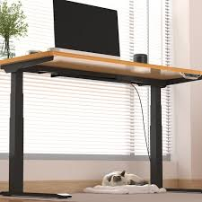
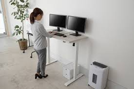
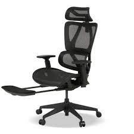
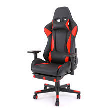
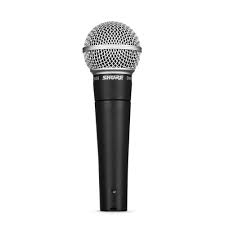
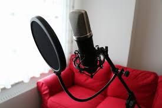
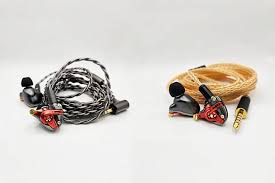

# 快適なデスク環境

---

## 昇降デスク

- 自分に合わせた机の高さに調整できる
- 立って作業することもできる！

---

## 椅子

- オフィスチェアかゲーミングチェア(合皮には注意！)
- 個人的には1個高いオフィスチェアを買うのがおすすめ！

---

## オーディオ関連
### マイク

- 音質が良い(しっかりと声が乗っている)と相手も聞きやすい
- USB接続できるマイクがあるので、安価なやつでもあるだけでだいぶ変わると思う
- こだわりだすと沼

---

## 個人的な趣味でいうと聞く方専門
- DACとオーディオインターフェースとか...
- イヤホン色々買ったり...

